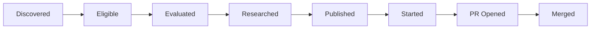

# Product and Operational Analytics

**Status:** Accepted for MVP  
**Storage:** PostgreSQL  
**Retention:** Indefinite during MVP  
**External analytics SaaS:** Not required

---

## 1. Goals

Analytics must answer:

1. Does OpenLead find tasks the user wants to work on?
2. Does research make starting a contribution easier?
3. Are effort estimates calibrated?
4. Does the system operate reliably within free quotas?
5. Do prompt changes improve recommendation quality?

Analytics is descriptive in the MVP. It does not automatically change scoring weights or prompts.

---

## 2. North-star and outcome metrics

### North-star

```text
Productive open-source hours completed per week
```

Merge timing depends on maintainers, so merged PR count alone is not sufficient.

### Contribution efficiency

```text
merged_contributions_per_20_hours =
    merged_contributions / actual_hours * 20
```

### Backlog usefulness

```text
task_start_rate =
    published tasks started /
    published tasks eligible to be started
```

```text
recommendation_acceptance_rate =
    accepted recommendations /
    reviewed recommendations
```

A high publication volume with a low start rate indicates poor ranking or excessive backlog creation.

---

## 3. Discovery funnel



Metrics:

```text
prefilter_pass_rate = eligible / discovered
evaluation_research_rate = research_requested / evaluated
research_completion_rate = researched / research_started
auto_publish_rate = auto_published / evaluated
review_publish_rate = manually_published / needs_review
task_start_rate = started / published
pr_open_rate = pr_opened / started
merge_rate = merged / pr_opened
```

Use stable cohort windows.

---

## 4. Recommendation quality

Track:

- accepted;
- rejected;
- ignored;
- deleted;
- manually prioritized;
- started despite low score;
- dropped after starting.

Rejection reasons:

```text
not_interesting
too_hard
too_easy
already_claimed
poor_repository
bad_estimate
insufficient_research
wrong_skill_match
manual_priority
```

Metrics:

```text
top_k_precision =
    accepted recommendations among top K /
    K reviewed recommendations
```

```text
false_publish_rate =
    tasks rejected for objective eligibility failures /
    published tasks
```

```text
research_helpfulness =
    average research rating on a 1-5 scale
```

```text
incorrect_file_rate =
    reports with an invalid file claim /
    completed reports
```

```text
insufficient_evidence_rate =
    insufficient-evidence runs /
    research runs started
```

---

## 5. Estimate calibration

Preliminary research counts as work time.

### Errors

```text
absolute_error_hours =
    abs(actual_hours - estimate_p50_hours)
```

```text
relative_error =
    abs(actual_hours - estimate_p50_hours) /
    max(actual_hours, 0.5)
```

```text
estimate_ratio =
    actual_hours / estimate_p50_hours
```

### Coverage

```text
p50_coverage =
    tasks with actual_hours <= p50 /
    tasks with actual_hours
```

```text
p90_coverage =
    tasks with actual_hours <= p90 /
    tasks with actual_hours
```

P50 should approach 50% coverage and P90 should approach 90% over sufficiently large samples.

### Segments

Report by:

- repository;
- language;
- task type;
- difficulty;
- score band;
- confidence band;
- model/provider;
- research performed/not performed;
- familiar/stretch skill category;
- prompt-bundle version.

### Bias

```text
mean_signed_error =
    average(actual_hours - estimate_p50_hours)
```

Positive values mean systematic underestimation.

---

## 6. Learning analytics

Track:

- tasks and hours by skill category;
- learning-value rating;
- familiar versus stretch work;
- stretch-task completion rate;
- repeated exposure to each learning goal;
- newly encountered frameworks/domains.

Metrics:

```text
learning_goal_hours =
    sum(actual_hours for tasks tagged with goal)
```

```text
stretch_completion_rate =
    completed stretch tasks /
    started stretch tasks
```

```text
learning_value_score =
    average post-task learning rating
```

These metrics do not automatically affect ranking in MVP.

---

## 7. Prompt analytics

Each run stores its `PromptBundle`.

Compare prompt revisions using:

- acceptance rate;
- task start rate;
- rejection reasons;
- research rating;
- estimate error;
- average score/confidence;
- publication volume;
- model usage and token volume.

### Guardrails

- Do not compare revisions across materially different repository mixes without segmentation.
- Do not treat low sample sizes as conclusive.
- Do not automatically activate a prompt because of one metric.
- Preserve exact agent-template and scoring-policy versions in comparisons.
- Prefer sequential periods over concurrent A/B testing for a single-user MVP.

Suggested report:

```text
prompt revision
active period
evaluations
published
accepted
started
completed
mean research rating
mean signed estimate error
```

---

## 8. Operational analytics

### Workflow

- success/retry/dead-job rates;
- stale leases;
- queue depth;
- queue wait;
- end-to-end latency;
- reconciliation lag.

### GitHub

- API calls;
- conditional-request hit rate;
- rate-limit responses;
- snapshots created;
- material-change rate;
- claim and competing-PR detection.

### MCP

- startup failures;
- tool calls per run;
- repeated tool calls;
- files read;
- evidence bytes;
- truncated responses;
- tool error rate;
- duration.

### Inference

- requests by provider/model/purpose;
- input/output tokens;
- validation retries;
- fallback count;
- quota exhaustion;
- cooldown duration;
- average tokens per evaluation/research;
- cost estimate, which must remain zero by policy.

### Linear

- creation success;
- duplicate prevention;
- lost-response recovery;
- managed-block conflicts;
- deletion tombstones;
- rate-limit responses.

### Prompt management

- drafts created;
- validation failures;
- activations;
- rollbacks;
- activation conflicts;
- runs per prompt bundle.

---

## 9. Event schema

```text
AnalyticsEvent
- id: UUID
- event_type: string
- schema_version: integer
- occurred_at: timestamp
- correlation_id: UUID
- workflow_run_id: UUID | null
- job_id: UUID | null
- repository_id: UUID | null
- source_issue_id: UUID | null
- snapshot_id: UUID | null
- assessment_id: UUID | null
- research_run_id: UUID | null
- tracked_task_id: UUID | null
- prompt_bundle_id: UUID | null
- actor: system | user | github | linear
- properties: JSONB
```

### Event catalogue

Repository/discovery:

```text
repository_registered
repository_scan_started
repository_scan_completed
repository_scan_failed
repository_profile_created
repository_profile_refreshed
issue_discovered
issue_snapshot_created
issue_material_change_detected
```

Analysis:

```text
issue_prefiltered
issue_rejected
issue_sent_to_review
evaluation_started
evaluation_completed
evaluation_failed
research_started
research_completed
research_insufficient_evidence
research_failed
candidate_ranked
```

Publication/reconciliation:

```text
linear_publish_started
linear_task_published
linear_publish_failed
linear_duplicate_prevented
linear_task_missing
linear_tombstone_created
linear_managed_block_updated
upstream_warning_created
upstream_issue_closed
upstream_issue_reopened
user_pull_request_detected
user_pull_request_merged
```

Feedback/outcome:

```text
recommendation_accepted
recommendation_rejected
task_started
task_dropped
task_completed
actual_hours_recorded
research_rating_recorded
learning_rating_recorded
```

Runtime/inference:

```text
job_enqueued
job_started
job_retried
job_waiting_for_quota
job_succeeded
job_failed
job_dead
model_request_started
model_request_completed
model_fallback_used
model_validation_retry
provider_quota_exhausted
mcp_tool_called
mcp_tool_failed
```

Prompts:

```text
prompt_revision_created
prompt_revision_validated
prompt_revision_validation_failed
prompt_revision_activated
prompt_revision_rolled_back
prompt_activation_conflict
prompt_bundle_created
```

---

## 10. Reports

### Weekly product report

- productive hours;
- published/started/completed tasks;
- open/merged PRs;
- rejection reasons;
- estimate bias;
- learning-goal hours;
- active prompt revisions.

### Weekly system report

- failed/dead jobs;
- quota exhaustion;
- fallback usage;
- GitHub/MCP/Linear errors;
- queue latency;
- duplicate prevention;
- prompt activation/rollback activity.

### Monthly calibration report

- P50/P90 coverage;
- error by repository/task/model;
- research helpfulness;
- top-K precision;
- prompt-revision comparisons.

No custom dashboard is required initially. SQL views and CLI/Markdown reports are enough.

---

## 11. Data quality

- Events are append-only.
- Schema versions are explicit.
- Actual-hours corrections emit new events.
- Deleted Linear tasks remain represented by tombstones.
- Model/provider IDs are stored exactly.
- Missing ratings are not zero.
- Cohort metrics exclude tasks without sufficient observation time.
- No metric automatically changes policy in MVP.
