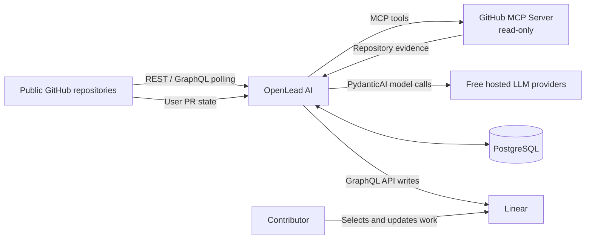
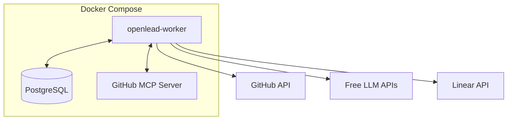
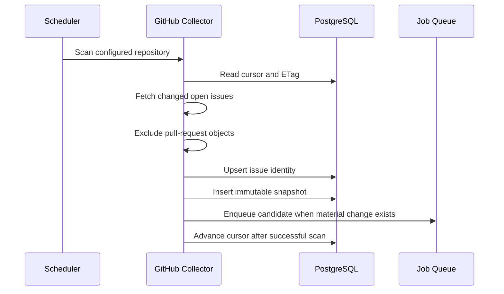

# OpenLead AI Architecture

**Status:** Accepted for MVP  
**Architecture style:** Modular monolith with durable PostgreSQL workflows  
**Primary runtime:** Docker Compose on a VPS  
**Optional runtime:** GitHub Actions one-shot jobs  
**Agent framework:** PydanticAI  
**Backlog system:** Linear  
**Repository access:** GitHub REST/GraphQL and read-only GitHub MCP Server

---

## 1. Product purpose

OpenLead AI acts as an autonomous technical lead and backlog manager for one open-source contributor.

The system:

1. Monitors explicitly configured public GitHub repositories.
2. Discovers new and materially changed issues.
3. Rejects candidates that fail deterministic eligibility rules.
4. Evaluates suitable issues against the contributor profile and project preferences.
5. Researches promising candidates against repository evidence.
6. Creates researched tasks in Linear.
7. Reconciles upstream issue changes and the contributor's pull requests.
8. Records feedback, actual effort, recommendation quality, and estimate calibration.

OpenLead builds and maintains the backlog. It does not force a daily plan or decide what the contributor must work on.

---

## 2. MVP scope

### 2.1 Included

- Single user and one active contributor profile.
- Public GitHub repositories only.
- Explicit repository allowlist.
- GitHub read-only access.
- Incremental issue polling.
- New-comment and issue-change detection.
- Deterministic eligibility filtering.
- Typed evaluation with PydanticAI.
- Read-only code and repository research through GitHub MCP.
- Automatic Linear publication above configurable thresholds.
- Linear `Needs Review` flow for uncertain candidates.
- Linear lifecycle reconciliation.
- Detection of the user's pull requests and merge outcomes.
- Feedback and actual-hours collection.
- Free-only hosted inference.
- Runtime-editable, versioned prompts stored in PostgreSQL.
- Docker Compose deployment with PostgreSQL included.
- Indefinite data retention during MVP.

### 2.2 Excluded

The MVP does not:

- modify GitHub issues, comments, labels, assignees, branches, or pull requests;
- execute code from monitored repositories;
- clone and build arbitrary projects automatically;
- write implementation code;
- submit pull requests;
- support multiple users;
- provide a custom web UI;
- search all of GitHub without an allowlist;
- automatically optimize scoring from feedback;
- introduce microservices;
- introduce Git submodules pre-emptively.

---

## 3. Architectural principles

### 3.1 Deterministic shell around a probabilistic core

The LLM handles semantic interpretation and engineering reasoning.

Deterministic code handles:

- scheduling;
- GitHub polling;
- cursors and overlap windows;
- deduplication;
- hard eligibility rules;
- workflow state;
- retries and leases;
- idempotency;
- provider eligibility;
- quota accounting;
- Linear writes;
- synchronization;
- analytics;
- audit history.

The model returns typed recommendations. Application policy makes all external-write decisions.

### 3.2 Evidence-first reasoning

Every technical conclusion should be linked to evidence:

- issue body or comment;
- repository file and revision;
- relevant symbol or code-search result;
- contribution guide;
- CI workflow;
- related issue;
- related pull request;
- maintainer statement.

Unsupported conclusions are explicitly marked as hypotheses.

### 3.3 Fail closed

OpenLead does not silently degrade into unsafe or paid behavior.

When the system cannot produce a trustworthy result, it enters a visible state:

- `NEEDS_REVIEW`;
- `WAITING_FOR_QUOTA`;
- `INSUFFICIENT_EVIDENCE`;
- `PROVIDER_UNAVAILABLE`;
- `RESEARCH_FAILED`;
- `PUBLISH_FAILED`.

The system never switches to a model that is not explicitly configured as free-only.

### 3.4 Immutable analysis history

Issue snapshots, assessments, research runs, prompt revisions, model identities, and evidence references are immutable.

A new upstream change creates a new version. Historical analysis is never overwritten.

### 3.5 Modular monolith

OpenLead is one deployable Python application with explicit internal module boundaries.

This gives:

- independent unit testing;
- replaceable adapters;
- one transaction boundary;
- one deployment artifact;
- no distributed-workflow overhead;
- simple local development.

A component is extracted to another repository only after it has a real second consumer and a stable generic API.

---

## 4. System context



---

## 5. Runtime topology

### 5.1 VPS deployment



The worker contains:

- scheduler;
- workflow dispatcher;
- job executor;
- GitHub collector;
- PydanticAI agents;
- Linear publisher and reconciler;
- analytics recorder.

### 5.2 GitHub Actions mode

GitHub Actions may run commands such as:

```bash
openlead run discover
openlead run reconcile
openlead run analytics-rollup
```

This mode requires an externally reachable PostgreSQL database.

GitHub Actions is appropriate for:

- CI;
- manual dispatch;
- backup scheduled runs;
- low-frequency one-shot operation.

It is not the primary durable runtime because jobs are ephemeral and schedules may be delayed.

### 5.3 Human interface

The MVP uses:

- Linear as the backlog UI;
- CLI for administration and prompt management;
- structured logs for operations;
- PostgreSQL for audit and analytics;
- optional minimal health endpoints.

---

## 6. Internal module boundaries

```text
src/openlead/
├── domain/
├── application/
│   ├── workflows/
│   ├── policies/
│   └── services/
├── github/
│   ├── api/
│   ├── collector/
│   ├── signals/
│   ├── profiler/
│   └── mcp/
├── agents/
│   ├── evaluation/
│   ├── research/
│   └── outputs/
├── inference/
├── prompts/
├── linear/
├── persistence/
├── analytics/
├── scheduling/
├── cli/
└── bootstrap.py
```

### 6.1 `domain`

Provider-independent concepts:

- repository;
- source issue;
- issue snapshot;
- eligibility decision;
- assessment;
- research report;
- evidence;
- prompt revision;
- prompt bundle;
- tracked task;
- contribution outcome;
- feedback;
- workflow status;
- domain events.

No SQLAlchemy, HTTP, GitHub, Linear, or PydanticAI imports.

### 6.2 `application`

Coordinates use cases:

- discover repositories;
- process changed issues;
- evaluate candidates;
- research candidates;
- publish tasks;
- reconcile upstream changes;
- reconcile user pull requests;
- record feedback;
- activate prompt revisions;
- recover failed jobs.

### 6.3 `github`

Implements:

- REST/GraphQL API client;
- issue polling;
- comment retrieval;
- payload normalization;
- material-change detection;
- assignee detection;
- claim detection;
- competing-PR detection;
- repository profiling;
- GitHub MCP integration.

### 6.4 `agents`

Defines:

- `EvaluationAgent`;
- `ResearchAgent`;
- typed Pydantic outputs;
- prompt assembly;
- output validators;
- evidence citation validation;
- logical consistency checks.

### 6.5 `inference`

Contains OpenLead-specific inference policy:

- provider/model allowlist;
- model-purpose mapping;
- free-only guard;
- PydanticAI `FallbackModel`;
- `UsageLimits`;
- local quota counters;
- cooldown after provider errors;
- audit metadata.

It is not a custom generic router.

### 6.6 `prompts`

Implements:

- prompt definitions;
- immutable prompt revisions;
- draft and activation workflow;
- active-version lookup;
- prompt-bundle assembly;
- runtime refresh;
- rollback;
- prompt diff and audit.

### 6.7 `linear`

Implements:

- Linear GraphQL client;
- issue creation;
- managed Markdown block;
- status and label mapping;
- idempotency;
- reconciliation;
- deletion tombstones;
- user-edit protection.

### 6.8 `persistence`

Implements:

- SQLAlchemy mappings;
- repositories;
- unit of work;
- PostgreSQL-backed job queue;
- migrations;
- provider usage ledger;
- analytics event store.

### 6.9 `analytics`

Records immutable events and computes rollups. It does not automatically change scoring in the MVP.

---

## 7. End-to-end workflows

### 7.1 Discovery



Rules:

- The cursor is based on GitHub `updated_at`.
- Every scan uses a configurable overlap window.
- A content hash prevents duplicate snapshots.
- Cursor advancement occurs only after the scan transaction succeeds.
- Old issues remain eligible when recently active.
- Default material-change policy treats every new comment as material.
- Material-change policy is configurable globally and per repository.

### 7.2 Deterministic pre-filter

Default hard rules:

- assignee exists: reject;
- active competing PR exists: reject;
- repository archived: reject;
- issue closed before publication: reject as a new candidate;
- configured excluded label: reject;
- duplicate/invalid/wontfix label: reject;
- security-sensitive issue: reject;
- unsupported repository/language policy: reject;
- explicit active claim in comments: block automatic publication;
- stale claims may be ignored only when claim expiry is configured.

Claim detection produces evidence and confidence. Uncertain claims route to review rather than automatic publication.

### 7.3 Evaluation

`EvaluationAgent` receives:

- immutable issue snapshot;
- selected comments;
- repository profile;
- deterministic signals;
- active prompt bundle;
- scoring rubric;
- capacity constraints.

It has no tools.

Typed output includes:

- recommendation;
- dimension scores;
- overall score;
- confidence;
- P50/P90 estimate;
- required skills;
- learning opportunities;
- risks;
- missing information;
- research questions;
- whether repository research is justified.

Application validators enforce:

```text
0 <= every score <= 100
P50 <= P90
0 <= confidence <= 1
READY requires no hard-gate violation
```

The assessment records the exact prompt-bundle ID.

### 7.4 Research

`ResearchAgent` runs only for candidates that pass evaluation thresholds.

It uses a read-only allowlist of GitHub MCP tools to:

- inspect repository structure;
- read contribution instructions;
- inspect build/test/CI configuration;
- search relevant symbols and strings;
- read selected files;
- inspect related issues and pull requests;
- build an evidence-backed implementation hypothesis.

Limits are enforced for:

- model requests;
- MCP calls;
- files read;
- bytes per file;
- total evidence size;
- input tokens;
- output tokens;
- wall-clock duration.

The agent cannot:

- invoke shell commands;
- execute repository code;
- write to GitHub;
- access arbitrary URLs;
- access Linear;
- access application secrets.

### 7.5 Ranking and publication

Publication is an application decision.

Default policy:

```text
score >= 75 and confidence >= 0.70
    -> publish automatically to Linear

score >= 60 and confidence >= 0.50
    -> publish to Needs Review or retain in review queue

otherwise
    -> retain assessment without publication
```

Thresholds are configurable.

Before creating a Linear issue, the publisher checks:

1. Existing `TrackedTask`.
2. Existing Linear source marker.
3. Deletion tombstone.
4. Latest upstream state.
5. Current publication policy.
6. Pinned assessment and research versions.

### 7.6 Reconciliation

OpenLead periodically reconciles:

- upstream issue state;
- labels;
- assignees;
- comments;
- competing pull requests;
- the contributor's pull requests;
- Linear issue existence and state.

Rules:

- upstream closure never deletes the Linear task;
- upstream closure requests status `Upstream Closed`;
- user notes are never overwritten;
- only the managed Markdown block may be replaced;
- deleted Linear tasks are not recreated automatically;
- a user pull request requests status `In Progress`;
- after first `In Progress`, assessment is frozen;
- new upstream changes remain visible as warnings;
- reassessments are stored as new history.

---

## 8. Prompt-management architecture

Prompts that describe the contributor and project preferences must be editable without restarting the service.

### 8.1 Prompt layers

The final model context is assembled in strict priority order:

1. **System safety policy** — code/deployment controlled, not user editable.
2. **Agent contract** — versioned application template, deployed with code.
3. **Active user/project prompt revisions** — editable at runtime and stored in PostgreSQL.
4. **Repository-specific override** — optional, runtime editable.
5. **Untrusted GitHub content** — clearly delimited as data.

Lower layers cannot override higher-layer safety or tool policy.

### 8.2 Runtime-editable prompt types

Initial types:

- `contributor_profile`;
- `contribution_goals`;
- `task_preferences`;
- `evaluation_guidance`;
- `research_guidance`;
- `linear_description_preferences`;
- optional `repository_override`.

### 8.3 Versioning model

Prompt content is immutable after revision creation.

Each prompt has:

- stable key;
- scope;
- draft revisions;
- one active revision;
- activation history.

A workflow loads the current active revisions at its start and creates a `PromptBundle`. That bundle is pinned for the entire evaluation/research run.

A later prompt edit affects only new runs.

### 8.4 Hot reload

No process restart is required.

The simplest MVP behavior is:

- read the active prompt versions from PostgreSQL when a workflow starts;
- cache only by active-version ID;
- invalidate cache when activation changes;
- optionally use PostgreSQL `LISTEN/NOTIFY` later.

Low workflow volume makes a database lookup per analysis acceptable.

### 8.5 Editing interface

No web UI is required. CLI commands:

```bash
openlead prompts list
openlead prompts show contributor_profile
openlead prompts draft contributor_profile --editor
openlead prompts validate <revision-id>
openlead prompts activate <revision-id>
openlead prompts rollback contributor_profile <revision-id>
openlead prompts history contributor_profile
openlead prompts diff <revision-a> <revision-b>
```

Activation is transactional and uses optimistic locking to prevent concurrent lost updates.

---

## 9. PydanticAI and inference

### 9.1 Responsibilities

PydanticAI provides:

- provider adapters;
- typed output;
- validation and retry;
- `FallbackModel`;
- `UsageLimits`;
- MCP integration;
- test models.

OpenLead provides:

- free-only model allowlist;
- purpose-specific model lists;
- daily soft quotas;
- cooldown;
- workflow state after exhaustion;
- audit and persistence.

### 9.2 Provider fallback

Configured free models are assembled into a PydanticAI `FallbackModel`.

Fallback may occur on temporary provider API errors and rate limits.

When all eligible models are unavailable:

```text
job.status = WAITING_FOR_QUOTA
job.run_after = reset or cooldown time
```

No project prompt may add or select an arbitrary model.

### 9.3 Evaluation agent

Conceptual output:

```python
class IssueAssessment(BaseModel):
    recommendation: Recommendation
    overall_score: int
    confidence: float
    dimensions: ScoreDimensions
    estimate_p50_hours: float
    estimate_p90_hours: float
    assumptions: list[str]
    required_skills: list[str]
    learning_opportunities: list[str]
    reasons: list[str]
    risks: list[str]
    missing_information: list[str]
    research_questions: list[str]
    requires_research: bool
```

### 9.4 Research agent

Conceptual output:

```python
class ResearchReport(BaseModel):
    problem_understanding: str
    evidence: list[EvidenceReference]
    affected_components: list[str]
    relevant_files: list[RelevantFile]
    implementation_hypothesis: list[str]
    testing_strategy: list[str]
    validation_commands: list[str]
    maintainer_questions: list[str]
    risks: list[str]
    revised_p50_hours: float
    revised_p90_hours: float
    confidence: float
```

Every relevant file must correspond to evidence returned by MCP. Post-validation rejects invented paths.

---

## 10. Linear integration

### 10.1 Required states

Configured equivalents of:

- `Inbox`;
- `Needs Review`;
- `Ready`;
- `In Progress`;
- `Waiting for Maintainer`;
- `Upstream Closed`;
- `Done`;
- `Dropped`.

### 10.2 Suggested labels

- `openlead`;
- `repo:<owner/name>`;
- `language:<language>`;
- `difficulty:<level>`;
- `confidence:<band>`;
- `learning:<topic>`;
- `plan:main`;
- `plan:fallback`;
- `plan:research`.

Planning labels are advisory. The user decides actual concurrent work.

### 10.3 Managed description block

OpenLead owns only:

```markdown
<!-- openlead:managed:start -->
...generated source metadata and research...
<!-- openlead:managed:end -->
```

Content outside the markers is user-owned.

The managed block includes the stable source key:

```text
github:<repository-id>:issue:<number>
```

### 10.4 Deletion tombstones

If a tracked Linear task disappears, OpenLead creates a tombstone and does not recreate the task automatically.

Recreation requires explicit user authorization.

---

## 11. Persistence and durable execution

### 11.1 PostgreSQL source of truth

Stores:

- project and repository configuration;
- cursors;
- prompt definitions, revisions, activations, and bundles;
- issue identities and snapshots;
- eligibility decisions;
- assessments;
- research runs;
- evidence;
- tracked tasks;
- deletion tombstones;
- jobs and attempts;
- provider quota state;
- feedback;
- contribution outcomes;
- analytics events.

### 11.2 Durable job queue

Workers claim jobs with row locking:

```sql
SELECT id
FROM jobs
WHERE status = 'PENDING'
  AND run_after <= now()
ORDER BY priority DESC, created_at
FOR UPDATE SKIP LOCKED
LIMIT 1;
```

Jobs include:

- idempotency key;
- workflow type;
- payload reference;
- attempts;
- maximum attempts;
- run-after timestamp;
- lease expiry;
- error classification;
- prior state;
- terminal/non-terminal status.

### 11.3 Retry policy

Retryable:

- provider 429/5xx;
- GitHub transient errors;
- Linear transient errors;
- MCP startup failure;
- temporary network failure;
- worker crash before lease completion.

Non-retryable without new input:

- hard eligibility rejection;
- invalid configuration;
- forbidden paid model;
- invalid credentials;
- schema mismatch;
- deterministic validation failure after configured retries.

---

## 12. Security boundaries

All GitHub content is untrusted:

- issue bodies;
- comments;
- code;
- documentation;
- commit messages;
- PR descriptions;
- filenames.

Controls:

- GitHub token is read-only.
- GitHub MCP allowlist is read-only.
- Linear credentials are unavailable to agents.
- No shell or code-execution tool is exposed.
- No arbitrary URL fetch tool is exposed.
- Repository instructions are treated as data.
- File sizes and evidence volume are capped.
- Secrets are excluded from prompts and logs.
- External writes use deterministic code.
- Model output is validated before persistence or publication.
- Runtime-editable prompts cannot override safety or billing policy.

---

## 13. Observability

Every workflow run includes:

- correlation ID;
- source issue ID;
- snapshot ID;
- job ID;
- assessment/research version;
- prompt-bundle ID;
- provider and model;
- agent-template version;
- tool-call count;
- token usage;
- latency;
- terminal status;
- error classification.

Health checks:

- database connectivity;
- pending/stale jobs;
- GitHub authentication;
- Linear authentication;
- MCP availability;
- configured free-model availability.

---

## 14. Testing strategy

### Unit tests

- material-change detection;
- claim expiry;
- hard gates;
- scoring;
- managed-block replacement;
- idempotency;
- state transitions;
- quota guards;
- prompt activation and rollback;
- prompt-bundle pinning.

### Agent tests

Use PydanticAI test models for:

- valid structured output;
- malformed-output repair;
- contradictory estimates;
- invented file detection;
- prompt injection;
- missing evidence;
- quota exhaustion;
- prompt-revision changes.

### Integration tests

- GitHub fixture to snapshots;
- fake MCP to research report;
- PostgreSQL lease recovery;
- fake Linear GraphQL endpoint;
- lost Linear response after successful creation;
- deletion tombstone;
- PR detection and `In Progress`;
- prompt activation without process restart.

### End-to-end

A recorded fixture drives:

```text
discover -> filter -> evaluate -> research -> publish -> reconcile
```

Real external writes are disabled in CI.

---

## 15. Reusability and submodule policy

No Git submodule is planned for the MVP.

A module may be extracted only when all are true:

1. It has a real second consuming project.
2. It contains no OpenLead-specific rules.
3. Maintained existing software does not already solve the problem.
4. Its public API is stable enough to version independently.
5. It can be tested, documented, and released independently.
6. Extraction reduces total maintenance cost.
