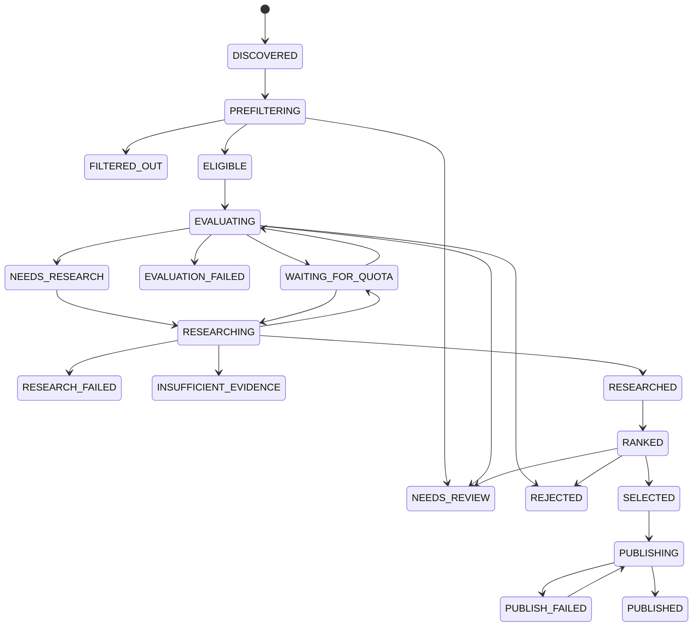
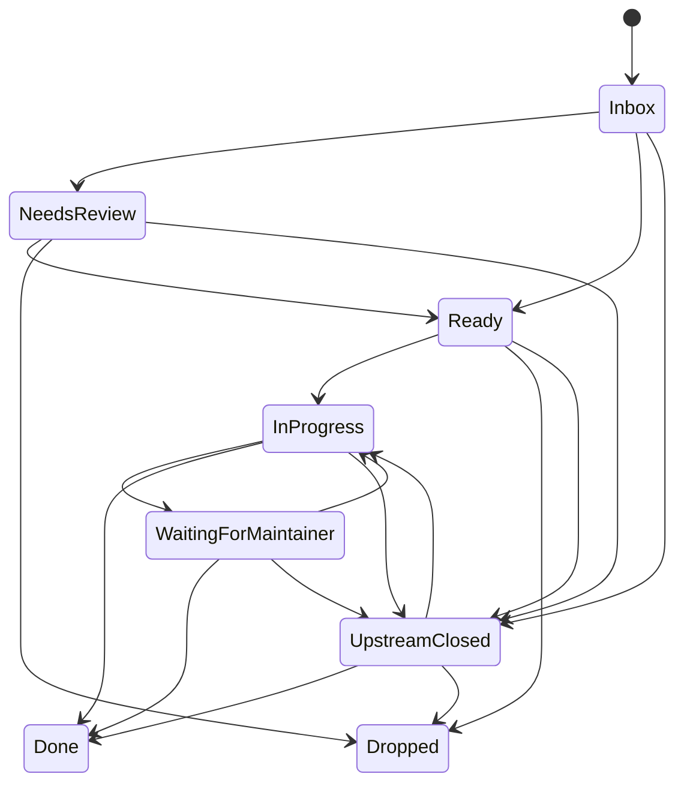
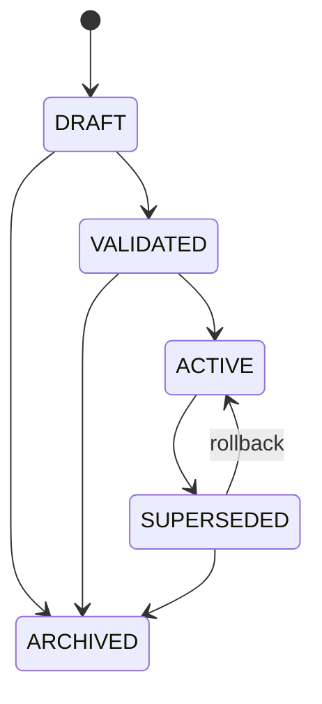
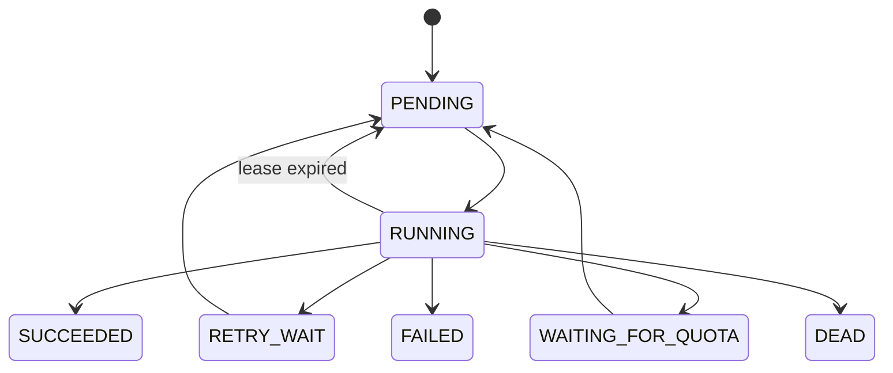

# Domain Model and State Machines

**Status:** Accepted for MVP

---

## 1. Core entities

### `Project`

```text
id
name
github_username
linear_workspace_id
linear_team_id
linear_project_id
created_at
updated_at
```

### `PromptDefinition`

Stable identity of a runtime-editable prompt.

```text
id
key
scope_type       # project | repository
scope_id
description
created_at
```

Unique key:

```text
(key, scope_type, scope_id)
```

### `PromptRevision`

Immutable prompt content.

```text
id
prompt_definition_id
revision_number
content_markdown
content_hash
status            # draft | validated | archived
created_by
created_at
validation_result
```

### `PromptActivation`

History of active-version changes.

```text
id
prompt_definition_id
prompt_revision_id
activated_at
activated_by
deactivated_at
```

Only one current activation exists per definition.

### `PromptBundle`

Immutable set of prompt revisions used by one analysis.

```text
id
bundle_hash
contributor_profile_revision_id
contribution_goals_revision_id
task_preferences_revision_id
evaluation_guidance_revision_id
research_guidance_revision_id
repository_override_revision_id
created_at
```

### `Repository`

```text
id
github_repository_id
owner
name
full_name
default_branch
enabled
priority
configuration
last_scan_cursor
last_scan_etag
last_successful_scan_at
last_profiled_head_sha
created_at
updated_at
```

GitHub repository ID is stable across rename/transfer.

### `RepositoryProfile`

```text
id
repository_id
head_sha
profile_version
languages
frameworks
repository_structure
contribution_rules
build_commands
test_commands
lint_commands
ci_summary
architecture_summary
maintainer_activity
generated_at
expires_at
```

### `SourceIssue`

```text
id
repository_id
github_issue_id
issue_number
source_url
first_seen_at
latest_snapshot_id
```

Unique:

```text
(repository_id, github_issue_id)
```

### `IssueSnapshot`

```text
id
source_issue_id
title
body
state
state_reason
labels
assignees
author
author_association
milestone
comment_count
created_at
github_updated_at
fetched_at
content_hash
raw_payload
```

### `EligibilityDecision`

```text
id
snapshot_id
decision           # eligible | rejected | manual_review
reason_codes
signals
policy_version
created_at
```

### `Assessment`

```text
id
snapshot_id
repository_profile_id
prompt_bundle_id
assessment_version
agent_template_version
policy_version
provider
model
recommendation
overall_score
confidence
dimensions
estimate_p50_hours
estimate_p90_hours
assumptions
required_skills
learning_opportunities
reasons
risks
missing_information
research_questions
usage
created_at
```

### `ResearchRun`

```text
id
assessment_id
prompt_bundle_id
repository_head_sha
research_version
agent_template_version
provider
model
status
report
usage
tool_call_count
started_at
completed_at
error
```

### `EvidenceItem`

```text
id
research_run_id
kind
repository_id
revision
path
symbol
github_issue_number
github_pr_number
comment_id
url
excerpt_hash
description
```

### `TrackedTask`

```text
id
source_issue_id
linear_issue_id
linear_identifier
linear_url
lifecycle_status
managed_block_hash
published_assessment_id
published_research_run_id
user_modified
created_at
last_reconciled_at
```

Unique:

```text
source_issue_id
```

### `TaskTombstone`

```text
id
source_issue_id
previous_linear_issue_id
detected_at
recreation_allowed
recreation_authorized_at
```

### `ContributionOutcome`

```text
id
tracked_task_id
started_at
actual_hours
pull_request_url
pull_request_number
pull_request_state
merged_at
completed_at
abandonment_reason
learning_value_rating
research_quality_rating
created_at
updated_at
```

### `Feedback`

```text
id
tracked_task_id
assessment_id
decision
reason
rating
comment
created_at
```

Rejection reasons:

```text
not_interesting
too_hard
too_easy
already_claimed
poor_repository
bad_estimate
insufficient_research
wrong_skill_match
manual_priority
```

---

## 2. Candidate processing state



A new material snapshot creates a new processing version.

---

## 3. Linear task lifecycle



Rules:

- User PR detection requests `In Progress`.
- Upstream closure requests `Upstream Closed`.
- No task is deleted automatically.
- `Done` is not inferred solely from upstream closure.
- Assessment freezes after first `In Progress`.
- New upstream events become warnings after freeze.
- Manual user state has precedence except for critical warnings.

---

## 4. Prompt revision lifecycle



Activation changes the active pointer; it does not mutate revision content.

---

## 5. Job lifecycle



---

## 6. Invariants

1. One source issue maps to at most one active tracked Linear task.
2. A tombstone blocks automatic recreation.
3. Every assessment references one immutable issue snapshot and one prompt bundle.
4. Every research run references one assessment, prompt bundle, and repository revision.
5. Every research file claim references evidence.
6. `P50 <= P90`.
7. Hard-gate rejection cannot be auto-published.
8. Active claim blocks automatic publication.
9. Active competing PR causes rejection.
10. No model outside the free-only allowlist is callable.
11. User content outside the Linear managed block is not overwritten.
12. Analysis and prompt histories are append-only.
13. Prompt activation affects only workflows started after activation.
